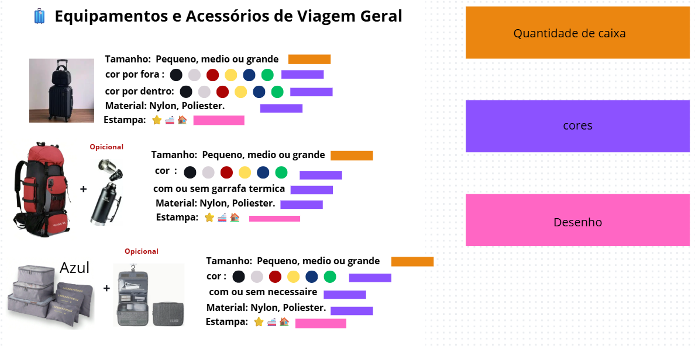

# 🌍 MIGRATION

Nossa lojinha foi criada pra quem ama colocar o pé na estrada e explorar o mundo com praticidade e estilo. Aqui, você encontra produtos essenciais pra viagem, trilhas e aventuras ao ar livre. Vendemos de tudo um pouco: mochilas resistentes, garrafas térmicas, lanternas, organizadores de mala, capas de chuva, mapas decorativos.

Cada item é escolhido a dedo pra garantir utilidade, durabilidade e aquele toque especial que faz diferença na hora de viajar. Seja pra quem tá indo fazer um mochilão, acampar no mato ou só quer um acessório legal pra lembrar uma viagem marcante — essa lojinha é pra você.
#

# ✨ Produtos Disponíveis e oque poderam mudar

# 👥Integrantes
[Naiara Rodrigues](https://github.com/naiara623?tab=repositories)

[Kayllany Ketylly](https://github.com/Kayllany04?tab=repositories)

[Laura Melek](https://github.com/LauraMelek2008?tab=repositories)
#

# 🖌️Figma

Acesse o protótipo completo no Figma:

👉[Migration no Figma](https://www.figma.com/design/qS3R6cvckxMy5R5YuBvDdG/Migration?node-id=0-1&p=f&t=AOy12IusvHT5vZLh-0) 
#

# 🤖 IA no Migration

Como adicionariamos a IA (Inteligencia artificial) em nosso projeto? 

- Atendimento ao cliente: 
 Chatbot para tirar dúvidas, ajudar na navegação e recomendar produtos.

- Análise de feedback:
 Sugerir itens com base no perfil e histórico do usuário.

- Guia Interativo:
Explicar como usar a loja, mostrar novidades ou promoções.

- Recomendações de produtos:
Facilitar o acesso de pessoas de outros países.

- Detecção de fraudes:
Proteger transações e dados dos usuários.

- Entregas:
Avisar quando o produto estiver em rota para o endereço
